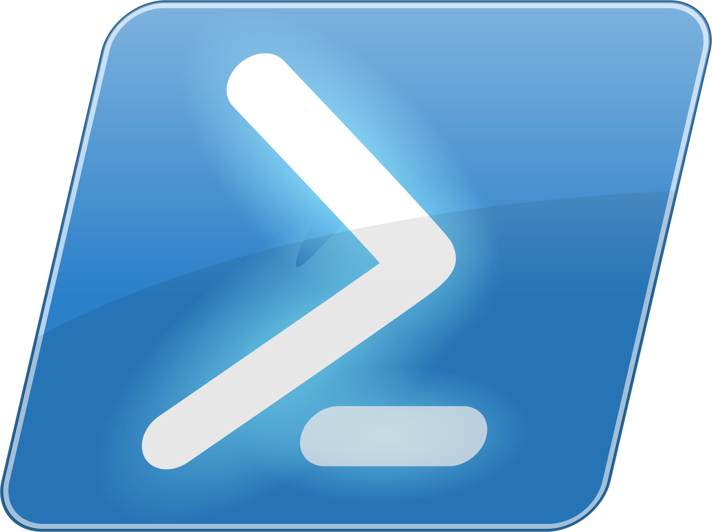
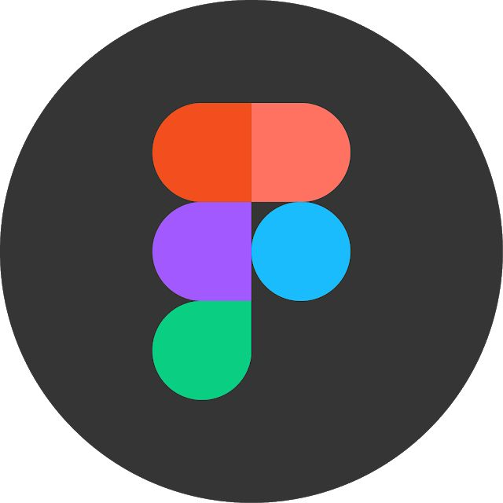

<h1>Hello World! 👋</h1>

<a class="badge-base__link LI-simple-link" href="https://www.linkedin.com/in/ayoola-atitebi/"> Atitebi Ayoola Emmanuel</a>

    
<h1>Welcome To ∆¥ØØL∆'S Profile 😌</h1>

###   **What's my current role in tech?** </h2>
       { Software Developer | Computer Scientist | Blogger } 

#### Connect with me 

#### About
Here are some basic things to know about ∆¥ØØL∆ 😎💻;

- 🔭 I’m currently working on honing my Frontend Dev skills,
- 🌱 I’m currently exploring Fullstack Web Development,
- 👯 I’m looking for people to collaborate with on projects.
- 🤔 I’m looking for help with expanding my knowledge on Backend Development,
- 💬 Ask me about anything 😌,
- 📫 How to reach me: Email: ayoolaemmanuel083@gmail.com, Phone: +2349029138135,
- 😄 Pronouns: He/Him/His,
- ⚡ Fun fact: I love Writing 📝.

#### My Core Languages
<code></code>
<code></code>
<code></code>
<!-- <code></code> -->
<!-- <code></code> -->
<!-- <code></code> -->

#### Frameworks/Libraries I Use
<code></code>
<code></code> 
<!-- <code></code> -->
<!-- <code></code> -->
<code></code> 
<!-- <code></code> -->
<!-- <code></code>
<!-- <code></code> -->
<!-- <code></code> -->
<!-- <code></code> -->

#### Tools I Use
<code></code>
<code></code>
<code></code>
<code></code>
<code></code>
<code></code>
<code></code>
<!-- <code></code> -->
<!-- <code></code> -->
<!-- <code></code> -->
<!-- <code></code> -->
             
             
       
#### Lifestyle

