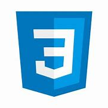
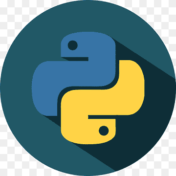
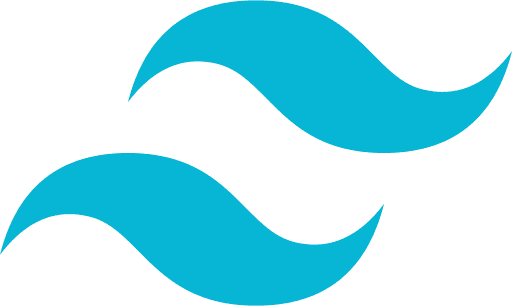
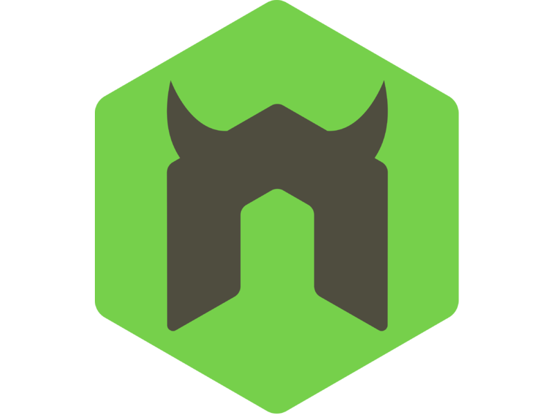
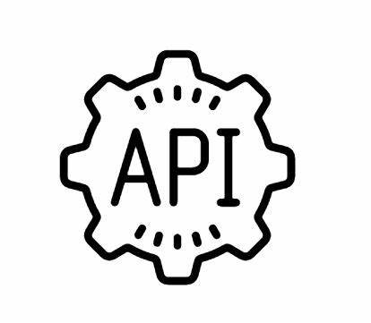
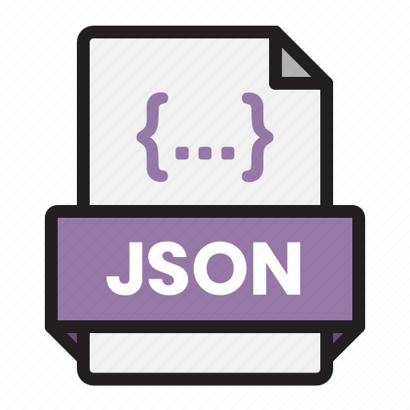
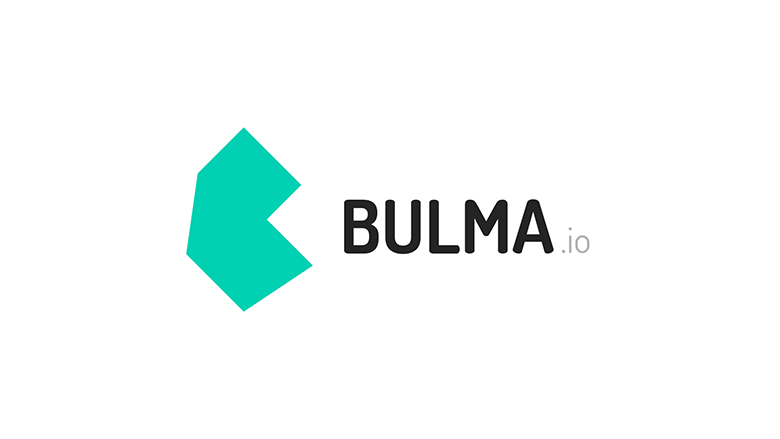
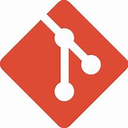
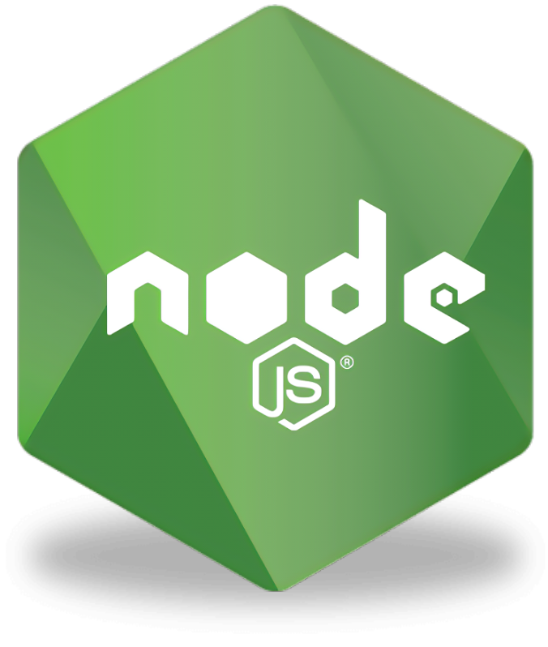
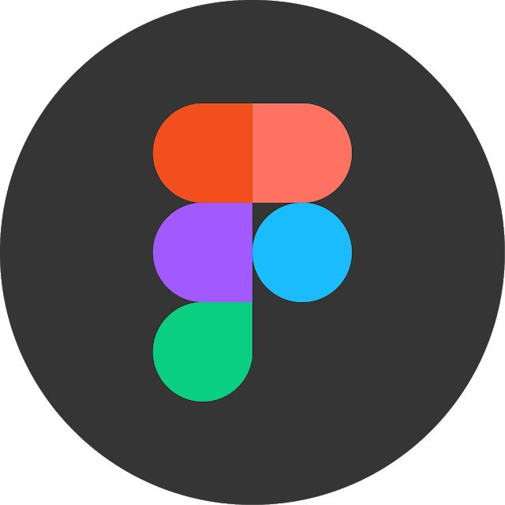

<h1>Hello World! 👋</h1>

<a class="badge-base__link LI-simple-link" href="https://www.linkedin.com/in/atitebi-ayoola/"> Atitebi Ayoola Emmanuel</a>

    
<h1>Welcome To ∆¥ØØL∆'S Profile 😌</h1>

###   **What's my current role in tech?** </h2>
       { Software Developer || Tech Enthusiast || Technical Writer } 

#### Connect with me 

#### About
Here are some basic things to know about ∆¥ØØL∆;

- 🔭 I’m working on honing my Backend Dev skills
- 🌱 I’m currently exploring Fullstack Web Development
- 👯 I’m looking for people to collaborate with on projects
- 💬 Ask me about anything 😌
- 📫 How to reach me: Email: ayoolatitebi@gmail.com
- 😄 Pronouns: He/Him/His
- ⚡ Fun fact: I'm a funny tech bro 😂

#### My Core Languages
<code></code>
<code></code>
<code></code>
 <code></code>
 <code></code>
<!-- <code></code> -->

#### Frameworks/Libraries I Use
<code></code>
<code></code>
  <code></code>
   <code></code>
    <code></code> 
     <code></code>
      <!-- <code></code> -->
<!-- <code></code> -->
<!-- <code></code> -->

#### Tools I Use
<code></code>
<code></code>
<code></code>
<code></code>
<code></code> 
<code></code> 
<code></code>

             
       
#### Lifestyle

